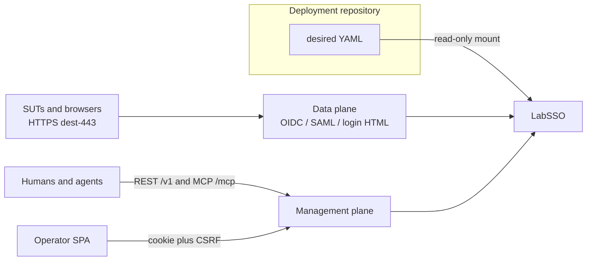

# LabSSO

**Laboratory SSO Identity Provider** with OIDC/OAuth2 now, SAML later, and vendor-shaped Entra / Okta / Ping / ADFS clothes.

Desired state is a versioned YAML file. Runtime mutations are ephemeral, revision-checked, and equally available over REST and MCP. Restart or reset returns the process to the mounted bootstrap.

[](LICENSE)

Status: **M2 default ship (generic OIDC + login HTML)** · Module [`github.com/hilather/go-lab-sso`](https://github.com/hilather/go-lab-sso) · Image `ghcr.io/hilather/labsso` · Binary `labsso` · Language: **Go 1.26** · Clothes/SAML/SPA/import/integrator still later

New here? Start with [START-HERE.md](START-HERE.md). Architecture, task lists, and ADRs are indexed in [Documentation](#documentation).

FND-001, OIDC-001, and LOGIN-001 are implemented: generic OIDC plus data-plane login/consent HTML. Vendor clothes, SAML, the operator SPA, import, and the integrator pin are still later.

---

## Why LabSSO

Labs need an Identity Provider they can **stand up**, **dress like a customer’s SSO**, and **reset**. LabSSO is that appliance:

| You need | LabSSO does |
|---|---|
| A lab that looks like the customer’s IdP | One exact issuer plus vendor path/claim clothes (Entra, Okta, Ping, ADFS, …) |
| Agents that can change users, clients, and sessions | One capability registry behind REST `/v1` and MCP `/mcp` |
| HTTPS dest-443 the way SUTs already speak to an IdP | Host TCP 443 → container unprivileged listen (e.g. `:10443`) |
| GitOps the lab | Read-only YAML bootstrap, drift export, reset-to-file |
| Force a login, consent, or token failure | Documented agent tunables (force fail, expire session, pause token, …) |
| Import a customer app registration | Allow-list rewriter → a `labsso.dev/v1alpha1` fragment the operator commits |

It is **not** a production IdP, a Keycloak / Dex / ORY wrap, or a hostname clone of `login.microsoftonline.com` / `okta.com`. It is **not** [go-jenkins-mcp](https://github.com/hilather/go-jenkins-mcp) (a separate product; never in-scope here).

LabSSO belongs to the hilather lab-appliance family: [LabDNS](https://github.com/hilather/go-lab-dns), [LabMail](https://github.com/hilather/go-lab-maildev), [LabMITM](https://github.com/hilather/go-lab-mitmproxy), [TacLab](https://github.com/hilather/go-lab-tacacs-mcp), [LabLDAP](https://github.com/hilather/go-lab-ldap-mcp). The integrator pin in [mcp-integration-lab](https://github.com/hilather/mcp-integration-lab) is **last**, after this appliance exists.

---

## Two planes



- **Data plane:** HTTPS IdP (OIDC/OAuth2, later SAML/WS-Fed, login + consent + MFA HTML). Must keep working if management is slow or unbound.
- **Management plane:** REST `/v1` + MCP `/mcp` as **adapters over one operation registry**. Never MCP-by-proxying-REST. Operator SPA uses cookie + CSRF, never `localStorage` for tokens. `spec.ui.enabled: false` 404s the operator SPA only — it does not disable data-plane login pages.

---

## Desired state (sketch)

LabSSO loads **one** `labsso.dev/v1alpha1` document. Unknown fields fail closed. IDs are user-supplied. Durations use Go syntax (`30s`, `5m`, `1h`) — bare numbers are rejected. Secrets are **file refs**, never inline.

Copy [testdata/config/valid/minimal.yaml](testdata/config/valid/minimal.yaml):

```yaml
apiVersion: labsso.dev/v1alpha1
kind: LabSSO
metadata:
  name: lab
spec:
  listeners:
    https:
      address: ":10443"
    management:
      address: ":8080"
      restPath: /v1
      mcpPath: /mcp
      mcp:
        allowLegacyClients: true
  issuer: "https://lab.example.net"
  profile:
    vendor: generic
  protocols:
    oidc:
      enabled: true
    saml:
      enabled: false
    wsfed:
      enabled: false
  clients: []
  users: []
  groups: []
  auth:
    sessionTTL: 1h
    mfa:
      mode: never
  groupOverage:
    entraGraphStub: true
    oktaFailAt: 100
  ui:
    enabled: true
  access:
    tokenRef: /run/secrets/labsso-token
```

Schema rules: [docs/04-state-and-configuration.md](docs/04-state-and-configuration.md). Invalid unknown-field fixture: [testdata/config/invalid/unknown-field.yaml](testdata/config/invalid/unknown-field.yaml).

---

## When implemented

Future CLI (not present in this repo):

```text
labsso validate --config lab.yaml
labsso canonicalize --config lab.yaml --format yaml
labsso serve --config lab.yaml
```

Hardened image: scratch, unprivileged UID **65532**, read-only root, `cap_drop: ALL`. Host publish: **TCP 443** → container `:10443`. Management stays on a high port (e.g. host 18443 or 8080-family). See [docs/11-deployment.md](docs/11-deployment.md) and [examples/compose.yaml](examples/compose.yaml).

MCP protocol pin: **2026-07-28**, official `go-sdk` **v1.7.0**. `spec.management.mcp.allowLegacyClients: true` is required for MCPJungle.

---

## Documentation

Full catalog: [docs/README.md](docs/README.md).

### Start here

| Document | Role |
|---|---|
| [START-HERE.md](START-HERE.md) | This repo is the design; read architecture then the program board |
| [AGENTS.md](AGENTS.md) | Mandatory rules for humans and AI agents |
| [CONTRIBUTING.md](CONTRIBUTING.md) | Workflow and review bar |
| [SECURITY.md](SECURITY.md) | Vulnerability reporting |
| [CHANGELOG.md](CHANGELOG.md) | Curated history |
| [MANIFEST.md](MANIFEST.md) | Pack inventory |

### Architecture

| Document | Topic |
|---|---|
| [docs/01-architecture.md](docs/01-architecture.md) | Two planes, snapshot, issuer, ports, TLS |
| [docs/02-protocols.md](docs/02-protocols.md) | OIDC/OAuth2, SAML, WS-Fed later |
| [docs/03-vendor-profiles.md](docs/03-vendor-profiles.md) | Clothes table |
| [docs/04-state-and-configuration.md](docs/04-state-and-configuration.md) | YAML, revisions, plan/apply/export/reset |
| [docs/05-control-plane-and-parity.md](docs/05-control-plane-and-parity.md) | Shared capability registry |

### Interfaces

| Document | Topic |
|---|---|
| [docs/06-rest-api.md](docs/06-rest-api.md) | Planned REST `/v1` |
| [docs/07-mcp-api.md](docs/07-mcp-api.md) | Planned MCP tools |
| [docs/09-customer-config-import.md](docs/09-customer-config-import.md) | Allow-list rewriter |

### Security, ops, program

| Document | Topic |
|---|---|
| [docs/08-security-architecture.md](docs/08-security-architecture.md) | Auth, trust boundaries, secrets |
| [docs/10-testing-strategy.md](docs/10-testing-strategy.md) | Test layers when code exists |
| [docs/11-deployment.md](docs/11-deployment.md) | Host 443, preflight, UID 65532 |
| [docs/18-roadmap-and-non-goals.md](docs/18-roadmap-and-non-goals.md) | Sequential slices and non-goals |
| [docs/19-acceptance-criteria.md](docs/19-acceptance-criteria.md) | Design-then-GA bar |
| [docs/20-threat-model.md](docs/20-threat-model.md) | Lab-only threat model |
| [docs/21-standards-and-references.md](docs/21-standards-and-references.md) | OIDC, OAuth2, SAML2, PKCE, MCP |
| [docs/known-limitations.md](docs/known-limitations.md) | Honest residuals |
| [docs/skeptic-notes.md](docs/skeptic-notes.md) | Sweep-1 folded; sweep 2 ACCEPT |

### Architecture decisions

- [0001 Use Go](docs/adr/0001-use-go.md)
- [0002 From scratch, not Keycloak](docs/adr/0002-from-scratch-not-keycloak.md)
- [0003 Ephemeral state and GitOps](docs/adr/0003-ephemeral-state-and-gitops.md)
- [0004 Shared capability registry](docs/adr/0004-shared-capability-registry.md)
- [0005 Vendor clothes, not hostnames](docs/adr/0005-vendor-clothes-not-hostnames.md)
- [0006 Native host 443](docs/adr/0006-native-host-443.md)
- [0007 No LabNTP time bus](docs/adr/0007-no-labntp-time-bus.md)
- [0008 Import allow-list rewriter](docs/adr/0008-import-allowlist-rewriter.md)
- [0009 Data-plane login UI](docs/adr/0009-data-plane-login-ui.md)

### Task lists and program board

- [tasks/README.md](tasks/README.md)
- [tasks/00-program-board.md](tasks/00-program-board.md)
- [tasks/agent-task-template.md](tasks/agent-task-template.md)
- [tasks/reviewer-checklist.md](tasks/reviewer-checklist.md)

---

## License

Apache-2.0. See [LICENSE](LICENSE). Copyright 2026 hilather.
