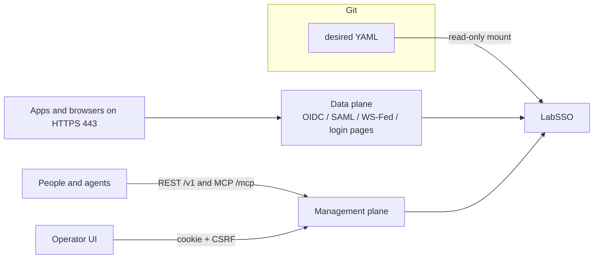

<p align="center">
  
</p>

<p align="center">
  <strong>A lab identity provider you can stand up, dress like a customer SSO, and reset.</strong>
</p>

<p align="center">
  <a href="LICENSE"></a>
  <a href="go.mod"></a>
  <a href="docs/02-protocols.md"></a>
  <a href="docs/02-protocols.md"></a>
  <a href="docs/07-mcp-api.md"></a>
</p>

LabSSO is the SSO box for a test lab. Point a product under test at it the way you would point at Entra, Okta, Ping, ADFS, Google, Keycloak, or IAM Identity Center. Desired state lives in one YAML file. Live changes go through REST or MCP and disappear when you reset or restart.

This is a lab appliance, not a production IdP and not a clone of `login.microsoftonline.com`.

New here? Read the [user guide](docs/user-guide.md). Want the short version? Stay on this page.

---

## What you get

| You need | LabSSO does |
|---|---|
| An IdP that looks like the customer's | One exact issuer, plus vendor-shaped paths and claims |
| A way to add users, clients, and sessions from a script or an agent | One operation list behind REST `/v1` and MCP `/mcp` |
| HTTPS on port 443, the way real apps talk to SSO | Host `443` maps to an unprivileged listener inside the container (`:10443`) |
| Git as the source of truth | Read-only YAML bootstrap, export the drift, reset back to the file |
| Forced login, consent, or token failures | Documented tunables |
| A customer app registration to replay | Allow-list import that writes a YAML fragment you can commit |

Same family as [LabDNS](https://github.com/hilather/go-lab-dns), [LabMail](https://github.com/hilather/go-lab-maildev), [LabMITM](https://github.com/hilather/go-lab-mitmproxy), [TacLab](https://github.com/hilather/go-lab-tacacs-mcp), and [LabLDAP](https://github.com/hilather/go-lab-ldap-mcp).

---

## Two planes



- **Data plane** — the IdP. Login pages, tokens, SAML, WS-Fed. Keeps working if management is down.
- **Management plane** — REST and MCP over the same operations. The operator UI uses a cookie and a CSRF header. Tokens never go in `localStorage`. Turning `spec.ui.enabled` off hides the operator UI only, not the login pages.

---

## Quick start

You need Go 1.26 and the repo secrets under `testdata/secrets/`.

```bash
git clone https://github.com/hilather/go-lab-sso.git
cd go-lab-sso

go run ./cmd/labsso validate --config testdata/config/valid/minimal.yaml
go run ./cmd/labsso serve --config testdata/config/valid/minimal.yaml
```

That loads the YAML, resolves secret file refs, compiles an in-memory snapshot, and binds:

- HTTPS IdP on `:10443`
- Management on `:8080` (`/v1` and `/mcp`)

Check it:

```bash
curl -sS http://127.0.0.1:8080/v1/health/ready
curl -sS http://127.0.0.1:8080/v1/state | head
```

From loopback you can skip a bearer token. Remote callers send `Authorization: Bearer` using the file in `spec.access.tokenRef`.

### Docker Compose

```bash
docker compose -f examples/compose.yaml up --build
```

Host `443` publishes to container `:10443`. Management stays on `127.0.0.1:8080`. The process runs as UID `65532` with a read-only root and no capabilities.

If host 443 is already taken, stop the occupant, bind an extra IP for `LAB_PUBLIC_HOST`, or set `LABSSO_HTTPS_PORT` (apps that hard-code dest 443 will not follow that last option).

---

## Configure YAML

LabSSO loads **one** document: `apiVersion: labsso.dev/v1alpha1`, `kind: LabSSO`.

Rules that matter on day one:

- Unknown fields are rejected.
- You pick the IDs.
- Durations use Go syntax (`30s`, `5m`, `1h`). Bare numbers fail.
- Secrets are file paths (`tokenRef`, `passwordRef`, TLS refs). Inline passwords and PEMs fail.
- The bootstrap file is read-only. The process never writes it.

Minimal file, also at [testdata/config/valid/minimal.yaml](testdata/config/valid/minimal.yaml):

```yaml
apiVersion: labsso.dev/v1alpha1
kind: LabSSO
metadata:
  name: lab
spec:
  listeners:
    https:
      address: ":10443"
      certRef: testdata/secrets/tls/tls.crt
      keyRef: testdata/secrets/tls/tls.key
    management:
      address: ":8080"
      restPath: /v1
      mcpPath: /mcp
      mcp:
        allowLegacyClients: true
  issuer: "https://lab.example.net"
  profile:
    vendor: generic
  protocols:
    oidc:
      enabled: true
    saml:
      enabled: false
    wsfed:
      enabled: false
  signing:
    keyRef: testdata/secrets/oidc/signing.pem
  clients: []
  users: []
  groups: []
  auth:
    sessionTTL: 1h
    mfa:
      mode: never
  groupOverage:
    entraGraphStub: true
    oktaFailAt: 100
    genericCap: 200
  ui:
    enabled: true
  access:
    tokenRef: testdata/secrets/labsso-token
```

Dress it like Entra by changing one field:

```yaml
profile:
  vendor: entra
  tenantId: "00000000-0000-0000-0000-000000000001"
```

Vendor values: `generic`, `entra`, `okta`, `ping`, `adfs`, `google`, `keycloak`, `iam-identity-center`.

Full field list: [docs/04-state-and-configuration.md](docs/04-state-and-configuration.md). More walkthroughs: [user guide](docs/user-guide.md).

---

## State loading APIs

The file on disk is the bootstrap. Runtime state is an overlay in memory. Revisions tell you whether they still match.

| Call | What it does |
|---|---|
| `labsso validate --config PATH` | Load, normalize, compile. Print `ok revision=sha256:…` |
| `labsso canonicalize --config PATH` | Same, then print canonical YAML (secret values stay refs) |
| `GET /v1/state` | Bootstrap revision, runtime revision, generation, drift flag, canonical doc |
| `POST /v1/state:validate` | Decode a document without swapping live state |
| `GET /v1/state:export` | Canonical YAML/JSON you can commit |
| `POST /v1/changes:plan` | Diff + impact, no swap |
| `POST /v1/changes:apply` | Plan, then atomic swap if the expected revision still matches |
| `POST /v1/state:reset` | Re-read the mounted file. If the file is now bad, live state stays |

MCP twins: `sso_state_get`, `sso_state_validate`, `sso_change_plan`, `sso_change_apply`, `sso_state_export`, `sso_state_reset`.

Load pipeline:

```text
read file
  → reject unknown fields
  → decode labsso.dev/v1alpha1
  → resolve secret file refs into memory
  → normalize defaults
  → validate cross-references
  → compile an immutable snapshot
  → compute bootstrap + runtime revisions
  → bind listeners
```

A bad bootstrap file does not listen.

### Read current state

```bash
curl -sS http://127.0.0.1:8080/v1/state
```

You get `bootstrapRevision`, `runtimeRevision`, `generation`, `drifted`, and `canonical`.

### Validate a document without applying it

```bash
curl -sS -X POST http://127.0.0.1:8080/v1/state:validate \
  -H 'content-type: application/json' \
  --data-binary @- <<'JSON'
{"document": {"apiVersion": "labsso.dev/v1alpha1", "kind": "LabSSO"}}
JSON
```

### Plan and apply a change

Desired-state writes need an expected revision (`expectedRevision`, `If-Match`, or `X-LabSSO-Expected-Revision`). Optional `Idempotency-Key` is remembered in a small in-memory list.

```bash
REV=$(curl -sS http://127.0.0.1:8080/v1/state | python3 -c 'import json,sys; print(json.load(sys.stdin)["runtimeRevision"])')

curl -sS -X POST http://127.0.0.1:8080/v1/changes:plan \
  -H 'content-type: application/json' \
  --data-binary @- <<JSON
{
  "expectedRevision": "$REV",
  "reason": "add a public client",
  "operations": [
    {
      "op": "add",
      "target": {"kind": "client", "id": "app-1"},
      "value": {
        "id": "app-1",
        "clientId": "app-1",
        "redirectURIs": ["https://sut.example.net/callback"],
        "public": true
      }
    }
  ]
}
JSON

curl -sS -X POST http://127.0.0.1:8080/v1/changes:apply \
  -H 'content-type: application/json' \
  -H "If-Match: $REV" \
  --data-binary @- <<JSON
{
  "expectedRevision": "$REV",
  "reason": "add a public client",
  "operations": [
    {
      "op": "add",
      "target": {"kind": "client", "id": "app-1"},
      "value": {
        "id": "app-1",
        "clientId": "app-1",
        "redirectURIs": ["https://sut.example.net/callback"],
        "public": true
      }
    }
  ]
}
JSON
```

### Export drift and reset

```bash
curl -sS 'http://127.0.0.1:8080/v1/state:export?format=yaml'
curl -sS -X POST http://127.0.0.1:8080/v1/state:reset
```

Reset never writes the bootstrap file. Restart has the same effect as reset: memory overlay is gone, the mounted YAML is loaded again.

Details: [docs/04-state-and-configuration.md](docs/04-state-and-configuration.md), [docs/06-rest-api.md](docs/06-rest-api.md), [docs/07-mcp-api.md](docs/07-mcp-api.md).

---

## CLI

```text
labsso validate     --config PATH [--base-dir DIR]
labsso canonicalize --config PATH [--format yaml|json] [--base-dir DIR]
labsso serve        --config PATH [--base-dir DIR]
                    [--https-listen ADDR] [--management-listen ADDR|off]
                    [--shutdown-timeout 5s] [--pid-file PATH]
labsso healthcheck  [--url http://127.0.0.1:8080/v1/health/ready]
labsso version
```

`--https-listen=off` is rejected. The IdP listener is required.

---

## What is implemented

OIDC/OAuth2 with PKCE, login and consent pages, vendor clothes for the full vendor list, group overage, SP-initiated SAML, WS-Fed, operator UI, allow-list import, REST, and MCP.

Not in this repo: wiring into the shared lab compose stack (that lives in `hilather/mcp-integration-lab`). SCIM outbound is documented only.

---

## Documentation

| Document | What it is |
|---|---|
| [docs/user-guide.md](docs/user-guide.md) | How to run it, write YAML, and use the state APIs |
| [START-HERE.md](START-HERE.md) | Short onboarding path |
| [docs/README.md](docs/README.md) | Full catalog |
| [docs/01-architecture.md](docs/01-architecture.md) | Two planes, snapshot, issuer, ports, TLS |
| [docs/04-state-and-configuration.md](docs/04-state-and-configuration.md) | YAML schema, revisions, plan/apply/export/reset |
| [docs/06-rest-api.md](docs/06-rest-api.md) | REST `/v1` |
| [docs/07-mcp-api.md](docs/07-mcp-api.md) | MCP tools |
| [docs/11-deployment.md](docs/11-deployment.md) | Host 443, image, compose |
| [CHANGELOG.md](CHANGELOG.md) | What changed |

Architecture notes and ADRs stay under [docs/](docs/). Contributor rules live in [AGENTS.md](AGENTS.md) and [CONTRIBUTING.md](CONTRIBUTING.md).

---

## License

Apache-2.0. See [LICENSE](LICENSE). Copyright 2026 hilather.
