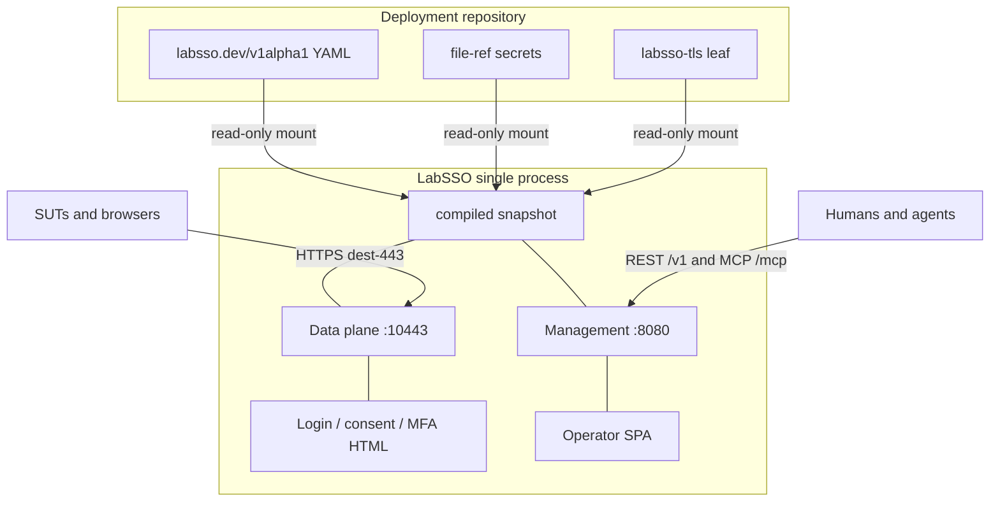

# System Architecture

Status: design (not implemented)
Owners: Architecture, Protocols, Control Plane, Deployment
Last reviewed: 2026-08-30
Related ADRs: 0001, 0002, 0003, 0004, 0005, 0006, 0007, 0009

## Problem statement

Laboratory systems-under-test already speak HTTPS to an enterprise Identity Provider. Agents need to stand up a lab that **looks like** a customer’s SSO — Entra, Okta, Ping, ADFS — without cloning production hostnames, wrapping Keycloak, or coupling login HTML to an operator console. The service must be equally controllable through REST and MCP, recover to a Git-controlled YAML baseline by restarting or resetting, and keep issuing tokens if the management plane is slow or unbound.

## Goals

- One process that is a laboratory IdP: OIDC/OAuth2 first, SAML and WS-Fed later.
- Vendor-shaped path, claim, cookie, and error clothes on **one exact issuer**.
- Two planes: data-plane HTTPS and management REST+MCP, adapters over one registry.
- Immutable, atomic runtime snapshots compiled from fail-closed YAML.
- Ephemeral memory overlay; bootstrap file is never written.
- Native host TCP 443 published to an unprivileged container listen.
- Container-first: scratch/distroless, UID 65532, read-only root, `cap_drop ALL`.
- Data-plane login + consent + MFA HTML distinct from the operator SPA.

## Non-goals

- Production Identity Provider, high-availability cluster, or multi-replica consensus.
- Wrapping Keycloak, Dex, ORY, Authelia, Authentik, or any other IdP.
- Hostname impersonation of `login.microsoftonline.com`, `okta.com`, or vendor CDNs.
- A LabNTP time bus inside LabSSO.
- Flattening LabSSO onto LabLDAP (optional LDAP bind is a later slice).
- go-jenkins-mcp features or Jenkins SSO wiring.
- Implementing the mcp-integration-lab pin in this repo (integrator is last).
- A database without a future ADR.
- Building the operator SPA in this design landing (Mira reviews after first UI implementation).

## Invariants

1. Data-plane HTTPS does not depend on REST or MCP availability.
2. Every authorize, token, JWKS, userinfo, logout, and login-HTML request sees one complete immutable runtime snapshot.
3. A state mutation is validated and compiled completely before activation.
4. REST and MCP call the same application capabilities. MCP is not a REST proxy.
5. Bootstrap YAML is read-only to the service. Restart and reset reread it.
6. Unknown configuration fields are errors.
7. Secrets are file refs, never inline.
8. One exact issuer string; vendor = clothes, not hostname clones.
9. Host dest-443 is the native publish. Management is not on 443.
10. Process clock only. No LabNTP bus.
11. `spec.ui.enabled: false` 404s the operator SPA only; login pages stay up.
12. Runtime drift is visible and exportable.

## Context diagram



```text
                       Deployment repository
              desired YAML, labsso-tls leaf, token files
                              |
                              v
                    read-only bootstrap mount
                              |
                    +---------------------+
 SUTs / browsers -> |      LabSSO         |
  HTTPS dest-443    |  data plane IdP     |
                    |  login + consent    |
                    |  immutable snapshot |
                    +----------+----------+
                               |
                  management network only
                     REST /v1 and MCP /mcp
                     operator SPA (optional)
                               |
                       humans and agents
```

## Two planes

### Data plane

The data plane is the IdP SUTs already know how to call:

- HTTPS listener, container address `:10443` by default, published as host **TCP 443**.
- OIDC/OAuth2 authorization-code + PKCE, discovery, JWKS, token, userinfo, logout (generic clothes first).
- Login, consent, and MFA HTML **required**. These pages are not the operator SPA.
- Later: SAML 2.0 SP-initiated SSO + IdP metadata; WS-Fed with ADFS clothes.
- Agent tunables that affect auth (force fail, force consent, expire session, pause token) execute here. Pausing the token endpoint must leave authorize, JWKS, discovery, and login HTML up.

If management is unbound (`--management-listen=off` in a future CLI) or saturated, the data plane continues with the last good snapshot.

### Management plane

The management plane is how agents and operators change the lab:

- Separate listener, default `:8080`, published on a high host port (18443 or 8080-family), **never 443**.
- REST `/v1` and MCP `/mcp` are adapters over one operation registry.
- Lab static bearer. Operator SPA (later) uses cookie + CSRF.
- `spec.management.mcp.allowLegacyClients: true` is required for MCPJungle. It skips the HTTP `Mcp-Protocol-Version` pin; it does not add a claimed protocol version and does not weaken bearer auth.
- `spec.ui.enabled: false` 404s `GET /` SPA routes only.

## Container and process model

The initial deployment is one process in one container:

- HTTPS IdP listener on an unprivileged container port such as 10443.
- Management HTTP on a management-only port (REST, MCP, later operator SPA).
- Metrics and health endpoints: management-only.
- No writable persistent volume. Runtime overlay is memory.
- Read-only bootstrap configuration. The process **never writes** that file.
- Optional in-memory audit ring; durable audit collection is external.

Host port 443 maps to container port 10443. The process runs as numeric **65532:65532** with all Linux capabilities dropped. `EACCES` / `EPERM` on a container bind is **not** host-443 occupancy: dockerd can still publish privileged host ports for an unprivileged process.

Image (when implemented): `ghcr.io/hilather/labsso`, distroless/scratch, no shell. Binary: `labsso`. Module: `github.com/hilather/go-lab-sso`. Language: Go 1.26.

## Issuer identity

One **exact** issuer string is derived from `LAB_PUBLIC_HOST` plus the published HTTPS port:

- Published 443 → `https://<LAB_PUBLIC_HOST>` (port omitted).
- Escape `LABSSO_HTTPS_PORT=8443` → `https://<LAB_PUBLIC_HOST>:8443`.

Discovery (`iss`), tokens, SAML EntityID (when enabled), and JWKS all use that string. Entra / Okta / Ping / ADFS change **path templates**, claim names, error JSON, cookies, and group-overage policy. They do **not** change the hostname to a vendor cloud.

See [ADR 0005](adr/0005-vendor-clothes-not-hostnames.md).

## Time

LabSSO uses the **process clock**. There is no LabNTP time bus, no step-slew API, and no in-process clock overlay. Kerberos and certificate-expiry skew reproductions belong on the SUT, driven by LabNTP, not inside the IdP. Token `iat` / `exp` / `nbf` and session TTL are computed from `time.Now` of the process.

See [ADR 0007](adr/0007-no-labntp-time-bus.md).

## Users and directory

`spec.users` and `spec.groups` are the source of truth in v1. Passwords are file refs or PHC hashes in secret files, not inline YAML. IDs are user-supplied. Optional LDAP bind is a **later slice** and must not flatten LabSSO onto LabLDAP: LabSSO remains the IdP; LabLDAP remains a directory appliance.

## Snapshot model

A compiled snapshot contains only immutable or internally concurrency-safe structures:

- Canonical normalized source state (`labsso.dev/v1alpha1`).
- Issuer string and published-port derivation.
- Vendor clothes tables (path templates, claim maps, cookie names, error dialect, overage policy).
- Client index by `client_id`.
- User and group indexes.
- Session and authorization-code tables are **runtime memory** layered on the snapshot, not Git state. Restart drops them.
- Signing-key material loaded from file refs (public JWKS compiled in; private keys stay off the snapshot’s exported form).
- Security, UI, and management indexes.
- Bootstrap revision, runtime revision, and generation metadata.

The active snapshot is held by an atomic pointer. A data-plane request loads the pointer once and retains that snapshot for the whole request. Session and code tables may be separate concurrent maps keyed by the snapshot generation; a swap that removes a client invalidates codes for that client.

## Control-plane mutation flow

```text
request
  -> authenticate and authorize
  -> validate expected revision and idempotency key
  -> apply operations to canonical state copy
  -> normalize
  -> validate full candidate (KnownFields already applied at decode)
  -> compile full candidate snapshot
  -> generate deterministic diff and impact summary
  -> if dry-run: return plan
  -> atomically swap active snapshot
  -> emit audit and state-change event
  -> return new revision
```

No mutation changes the live object graph in place. Import is a plan/apply operation that produces a YAML fragment, not a silent live merge.

## Data-plane request flow

```text
receive HTTPS
  -> TLS terminate with labsso-tls leaf
  -> load one snapshot
  -> route by vendor path clothes (authorize / token / jwks / userinfo / logout / login)
  -> admit client, user, PKCE, session
  -> apply agent tunables (force-fail, pause-token, …)
  -> mint or refuse
  -> write HTML or JSON in the vendor error dialect
```

Management failure cannot take this path down.

## Recommended Go package boundaries (when implemented)

```text
cmd/labsso                 process entrypoint and CLI wiring
internal/model             canonical domain types
internal/app               commands, queries, plans, authorization hooks
internal/config            YAML decoding, KnownFields, normalization
internal/compiler          immutable snapshot compilation
internal/snapshot          active/previous/bootstrap snapshot store
internal/oidc              authorization code, PKCE, discovery, JWKS, tokens
internal/saml              later: SP-initiated SSO and metadata
internal/wsfed             later: WS-Fed with ADFS clothes
internal/loginui           data-plane login / consent / MFA HTML
internal/vendor            clothes tables (not hostname maps)
internal/import            allow-list rewriter
internal/control/rest      REST transport adapter
internal/control/mcp       MCP transport adapter
internal/web               later: embedded operator SPA (no app import)
internal/capabilities      capability registry and parity metadata
internal/auth              management authentication, scopes, actor identity
internal/audit             mutation and security events
internal/observability     metrics, tracing, structured logs
internal/buildinfo         version, commit, protocol compatibility
```

Third-party OIDC, SAML, and MCP types must not escape their adapters.

## TLS

Integrator last (documented, not implemented here): a **new** leaf under `secrets/labsso-tls/`, lab-CA signed. Do not reuse the LabMITM or LabLDAP certificate. The leaf hostname is `LAB_PUBLIC_HOST`, not a vendor hostname.

Data-plane HTTPS uses that leaf. Management may stay HTTP on loopback in the first implementation; remote management TLS is a deployment choice.

## Ports

| Role | Host | Container | Notes |
|---|---|---|---|
| Data plane HTTPS | **443** | `:10443` | dest-443; integrator rule 15 |
| Management REST+MCP+SPA | 18443 or 8080-family, loopback by default | `:8080` | never 443 |
| Escape | `LABSSO_HTTPS_PORT` | still unprivileged | not the default |

Preflight fail-closed if a non-lab process holds host 443. Error text must name: stop/disable the occupant (nginx, caddy, apache, another compose stack) **or** extra IP for `LAB_PUBLIC_HOST` **or** escape `LABSSO_HTTPS_PORT` (SUTs that cannot set dest port cannot follow the escape).

See [docs/11-deployment.md](11-deployment.md) and [ADR 0006](adr/0006-native-host-443.md).

## Failure modes

- Invalid bootstrap: fail startup before binding HTTPS unless an explicit safe fallback is configured. Design default: do not listen.
- Invalid runtime mutation: reject without changing the active snapshot.
- Management unbound or saturated: data plane continues.
- Token endpoint paused by an agent tunable: authorize, discovery, JWKS, login HTML stay up.
- Signing-key file missing: fail closed at compile; do not mint with an ephemeral implicit key.
- Previous snapshot unavailable: reset still reloads the bootstrap file.
- Host 443 occupied by a non-lab process: preflight fails with the three named fixes.

## Security considerations

The service must enforce management-plane authentication, per-capability authorization, request size and rate limits, non-root container execution, file-ref secrets, and hardened XML on import. See the security architecture and the lab-only threat model.

## Observability

Expose bounded metrics for protocol, vendor clothes, token result, login result, management mutations, and auth failures. Never use authorization codes, refresh tokens, passwords, or raw bearer values as metric labels.

## Testing strategy

Architecture invariants require unit, protocol, race, integration, parity, container, and config-compat tests once code exists. Snapshot swaps and paused-token isolation require race and leak testing.

## Compatibility implications

Public REST paths, MCP tool schemas, configuration versions, issuer derivation, vendor identifiers, and state export formats are compatibility surfaces. Internal package boundaries are not public APIs.

## Open questions

- Sweep 2 after these docs land (see [skeptic-notes.md](skeptic-notes.md)).
- Whether first implementation serves management HTTP only on loopback or also terminates TLS on the management port.
- JWKS key-rotation UX beyond file-ref replace + apply.
- Exact PHC algorithms accepted for password file refs (document in CFG when implemented).
